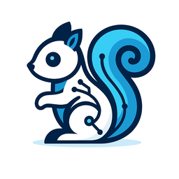

# Ratatoskr

A lightweight Telegram <-> Kafka bridge written in **Rust**, designed to decouple message ingestion from processing logic.



[](https://github.com/yourusername/ratatoskr)

## 🚀 Features

* Uses [`teloxide`](https://github.com/teloxide/teloxide) for Telegram bot integration
* Uses [`rdkafka`](https://github.com/fede1024/rust-rdkafka) for Kafka connectivity
* Forwards full Telegram message objects to Kafka
* **Automatic image downloading** - Downloads images from Telegram messages and stores them locally ([documentation](docs/image_downloading.md))
* Listens for outbound messages on a Kafka topic and sends them back to Telegram
* Minimal, event-driven, and easy to extend

## 📦 Prerequisites

* [Rust](https://www.rust-lang.org/tools/install)
* A Kafka broker (default: `localhost:9092`)
* A Telegram bot token from [@BotFather](https://t.me/BotFather)

## ⚙️ Setup

1. **Clone the repository:**

   ```sh
   git clone https://github.com/yourusername/ratatoskr.git
   cd ratatoskr
   ```

   Alternatively, you can download the source code directly from the [GitHub repository](https://github.com/yourusername/ratatoskr/releases).

2. **Set environment variables:**

   * `TELEGRAM_BOT_TOKEN` (**required**)
   * `KAFKA_BROKER` (optional, default: `localhost:9092`)
   * `KAFKA_IN_TOPIC` (optional, default: `com.sectorflabs.ratatoskr.in`)
   * `KAFKA_OUT_TOPIC` (optional, default: `com.sectorflabs.ratatoskr.out`)
   * `IMAGE_STORAGE_DIR` (optional, default: `./images`)

   You can place these in a `.env` file or export them in your shell. A `.env.example` file is provided as a template.

3. **Build and run the bot:**

   ```sh
   cargo build --release
   ./target/release/ratatoskr
   ```

   Or simply:
   
   ```sh
   cargo run --release
   ```

## 🔄 Development

For development with auto-reload:

```sh
cargo install cargo-watch
cargo watch -x run
```

To run tests:

```sh
cargo test
```

## 🐳 Containerization

### Using Docker

To containerize the application for deployment:

1. **Using the provided Dockerfile:**

   The project includes a Dockerfile that sets up a multi-stage build for a lightweight container:

   ```dockerfile
   FROM rust:1.75-slim as builder
   WORKDIR /app
   COPY . .
   RUN cargo build --release

   FROM debian:bullseye-slim
   RUN apt-get update && apt-get install -y libssl-dev ca-certificates && rm -rf /var/lib/apt/lists/*
   WORKDIR /app
   COPY --from=builder /app/target/release/ratatoskr /app/ratatoskr
   COPY --from=builder /app/.env* /app/
   ENV RUST_LOG=info
   CMD ["./ratatoskr"]
   ```

2. **Build and run the Docker image:**

   ```sh
   docker build -t ratatoskr:latest .
   docker run -d --name ratatoskr \
     -e TELEGRAM_BOT_TOKEN=your_token_here \
     -e KAFKA_BROKER=kafka:9092 \
     ratatoskr:latest
   ```

### Using Docker Compose

For a complete development environment with Kafka, Zookeeper, and Kafdrop (a Kafka UI):

1. **Run with docker-compose:**

   ```sh
   # Make sure TELEGRAM_BOT_TOKEN is set in your environment or .env file
   docker-compose up -d
   ```

2. **Access services:**
   - Ratatoskr: Running in container
   - Kafka: localhost:9092
   - Kafdrop (Kafka UI): http://localhost:9000


---

## 📤 Unified Message Types

Ratatoskr uses a unified message type system for consistent handling of all Kafka communications. For detailed documentation, see [Unified Message Types](docs/unified_message_types.md).

### Incoming Messages to `KAFKA_IN_TOPIC` (e.g., `com.sectorflabs.ratatoskr.in`)

All messages from Telegram are wrapped in the unified `IncomingMessage` type:

#### Telegram Message Example
```json
{
  "message_type": {
    "type": "TelegramMessage",
    "data": {
      "message": {
        "message_id": 123,
        "from": { "id": 456, "first_name": "User", "username": "testuser" },
        "chat": { "id": 789, "type": "private" },
        "date": 1678901234,
        "text": "Hello bot!"
      },
      "downloaded_images": [
        {
          "file_id": "AgACAgIAAxkDAAIC_mF...",
          "file_unique_id": "abc123def456",
          "width": 1920,
          "height": 1080,
          "file_size": 245760,
          "local_path": "/absolute/path/to/images/-123456789_42_abc123def456_1703123456.jpg"
        }
      ]
    }
  },
  "timestamp": "2023-12-01T10:30:00Z",
  "source": {
    "platform": "telegram",
    "bot_id": null,
    "bot_username": null
  }
}
```

#### Callback Query Example
```json
{
  "message_type": {
    "type": "CallbackQuery",
    "data": {
      "chat_id": 123456789,
      "user_id": 987654321,
      "message_id": 54321,
      "callback_data": "action_1",
      "callback_query_id": "1234567890123456789"
    }
  },
  "timestamp": "2023-12-01T10:30:00Z",
  "source": {
    "platform": "telegram",
    "bot_id": null,
    "bot_username": null
  }
}
```

### Outgoing Messages from `KAFKA_OUT_TOPIC` (e.g., `com.sectorflabs.ratatoskr.out`)

All messages to Telegram use the unified `OutgoingMessage` type:

#### Text Message Example
```json
{
  "message_type": {
    "type": "TextMessage",
    "data": {
      "text": "Hello from Ratatoskr! This message can have buttons.",
      "buttons": [
        [
          {"text": "Button 1", "callback_data": "action_1"},
          {"text": "Button 2", "callback_data": "action_2"}
        ]
      ],
      "parse_mode": "HTML",
      "disable_web_page_preview": false
    }
  },
  "timestamp": "2023-12-01T10:30:00Z",
  "target": {
    "platform": "telegram",
    "chat_id": 123456789,
    "thread_id": null
  }
}
```

#### Image Message Example
```json
{
  "message_type": {
    "type": "ImageMessage",
    "data": {
      "image_path": "/path/to/image.jpg",
      "caption": "Check out this image!",
      "buttons": [
        [{"text": "Like", "callback_data": "like_image"}]
      ]
    }
  },
  "timestamp": "2023-12-01T10:30:00Z",
  "target": {
    "platform": "telegram",
    "chat_id": 123456789,
    "thread_id": null
  }
}
```

### Supported Message Types

- **TextMessage** - Send text with optional formatting and buttons
- **ImageMessage** - Send images from local filesystem
- **DocumentMessage** - Send documents/files from local filesystem  
- **EditMessage** - Edit previously sent messages
- **DeleteMessage** - Delete messages from chat

### Legacy Format Support

The old message format is still supported for backwards compatibility:

```json
{
  "chat_id": 123456789,
  "text": "Hello from legacy format!",
  "buttons": [
    [{"text": "Button", "callback_data": "action"}]
  ]
}
```

For complete documentation, see [Unified Message Types](docs/unified_message_types.md).
For practical examples and usage patterns, see [Examples](docs/examples.md).
For troubleshooting common issues, see [Troubleshooting Guide](docs/troubleshooting.md).

## 🧠 Why Ratatoskr?

Inspired by the mythical squirrel that relays messages across realms, Ratatoskr is built to relay messages between users and intelligent systems, using Kafka as the messaging backbone.

## 🤝 Contributing

Contributions are welcome! Please feel free to submit a Pull Request.

1. Fork the project
2. Create your feature branch (`git checkout -b feature/amazing-feature`)
3. Commit your changes (`git commit -m 'Add some amazing feature'`)
4. Push to the branch (`git push origin feature/amazing-feature`)
5. Open a Pull Request

## 📃 License

This project is licensed under the BSD 3-Clause License - see the LICENSE.md file for details.
